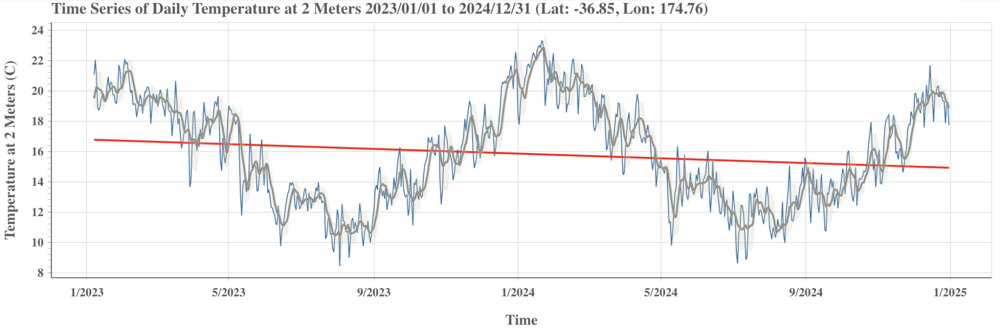

This interactive worked example has been adapted from the first lab task for DATASCI 100, and introductory data science course taught at the University of Auckland | Waipapa Taumata Rau.

::: callout-note
For the labs actually used with students, a more advanced computational environment is used, to track and save student interactions within the lab task. 
:::

This is a modified version of the lab task used, as some aspects of the lab task link to material/activities covered in the lectures before the lab task. Our lab tasks also provide interactive "tinker questions" (see Fergusson & Pfannkuch, 2022) which are not included in this version.

This version of the lab task was created using [Quarto]() and the Quarto extension [`{code-blanks}`]().

## Coding is for everyone!

For these labs, we are not focusing too much on the finer details of the code used. Rather than traditional worked examples, where things might be defined first, we will instead use code to generate things for a purpose, and then review key features of the code after.


We have used a learning technique called progressive reveal for this lab task, so that you are not overwhelmed by a huge document of text to read at the beginning of the lab. Instead, as you work through, more and more of the text and lab is revealed. 

Your progress in the lab will be saved automatically, so you can complete the lab over several different sessions if you need, as long as you are using the same browser. You can clear all the saved work using the button found at the top of this page.

## Ready to get staRted?

As explained earlier, these labs will focus on developing your skills to read and adapt code written in the programming language {R}. 

`R` was developed by Ross Ihaka and Robert Gentleman while they were both statistics lecturers here at the University of Auckland. It's a popular programming language for analysing data and used by data scientists around the world.


`R` you ready?

## Tracking weather data over time

During the lectures this week, we have explored a few different examples of data being tracked over time. Another example is data we can track over time is weather data, often called **meteorological** or **climate data**. 

The kinds of variables that we might record data about on an hourly or daily basis include temperature, wind speed, humidity, and precipitation (rainfall). Data about the weather can be tracked using a variety of devices. You can even buy your own weather station to track data from your home! 

In New Zealand, the [MetService](https://www.metservice.com/) is the main organisation for collecting and sharing weather data. The MetService has a number of dedicated weather reporting stations throughout New Zealand and various offshore islands.

<iframe id="widget-iframe" width="280px" height="205px" src="https://services.metservice.com/weather-widget/widget?params=blue|small|landscape|days-3|classic&loc=auckland&type=urban" allowtransparency="true" style="border:none"></iframe>

```{code-blanks-instructions}
Head to [their page which lists the towns and cities](https://www.metservice.com/towns-cities) and pick a location outside of Auckland. 
```

```{code-blanks-response}
Enter the name of this location in the box below.
```

## NASA weather data

NASA (National Aeronautics and Space Administration) is a US-based government agency. They use satellites and associated models to provide free weather data for locations around the world through their POWER (Prediction Of Worldwide Energy Resources) service. 

In the lectures, we learned how to visualise weather data about a location in New Zealand using NASA’s data access viewer ([power.larc.nasa.gov/data-access-viewer](https://power.larc.nasa.gov/data-access-viewer/)). Use the same steps as in the video to visualise (graph) the temperature data for the location within New Zealand you selected earlier in the lab.

::: callout-note
We will use weather data sourced from NASA for the rest of this lab, including the final lab challenge.
:::

## How’s the weather in Auckland?

The visualisation below was produced by the NASA data access viewer and displays the temperature in Auckland, along with some extra modelling components such as the red trend line (we won’t worry about these additional modelling components for now). 



```{code-blanks-response}
What do you notice about the temperature in Auckland over this time?
```

```{code-blanks-response}
Were there any temperatures recorded above 24 degrees celsius?
```

```{code-blanks-response}
Were there any temperatures recorded below 12 degrees celsius?
```

```{code-blanks-response}
Does it look like it’s the coldest in Auckland around July/August?
```

```{code-blanks-response}
Is December always the hottest month of the year?
```


## Recreating the visualisation with R code

We can recreate the visualisation above using R code. 

```{code-blanks-instructions}
Press the “Run code” button below to re-produce the visualisation.
```

```{code-blanks-functions}
get_nasa_weather_data <- function(location, start_date = NULL, end_date = format(Sys.Date() - 1, "%Y-%m-%d")) {
  locations <- c(location)
  data <- map_df(locations, function(loc) {
    url <- paste0("https://www.stat-edu.cloud.edu.au/foo/nasa_weather_data.php?location=", loc,"&start_date=", start_date, "&end_date=", end_date) %>% URLencode()
    tryCatch({
      result <- fromJSON(url)
      if (length(result) == 0) {
        return(tibble())
      }
      as_tibble(result)
    }, error = function(e) {
      return(tibble())
    })
  })
  if (nrow(data) == 0) {
    stop("No data for that location - please try again", call. = FALSE)
  }
  data %>%
    mutate(date = ymd(date))
}

```

```{code-blanks}
#| blank:
#|  target: "Auckland"
#|  prefill: true
#|  occurrence: 1
#|  match: text

weather_data <- get_nasa_weather_data(location = "Auckland",
                                      start_date = "2023-01-01",
                                      end_date = "2025-01-01")
  
ggplot(data = weather_data) +
  geom_line(aes(x = date, 
                y = temperature_C, 
                colour = location))
```

::: callout-note
Code is just “fancy text” where certain features of the text can tell the computer what to do when reading/processing the code.
:::

In the code we just “ran”, we used a **function** named `get_nasa_weather_data` to do just that - get weather data from NASA! 

To get weather data, the computer needs to know where you want the data from, which is why we wrote `"Auckland"` after the `location = ` part of the code within the `()` brackets.

## Don’t misquote me!

Because Auckland is the name of an actual place, we needed to put `""` quotes around it. 

```{code-blanks-instructions}
Run the code below **just as it is without changing it** to see what happens if we don’t use quotes!
```

```{code-blanks}
#| blank:
#|  target: Auckland
#|  prefill: true
#|  occurrence: 1
#|  match: text

weather_data <- get_nasa_weather_data(location = Auckland,
                                      start_date = "2023-01-01",
                                      end_date = "2025-01-01")
  
ggplot(data = weather_data) +
  geom_line(aes(x = date, 
                y = temperature_C, 
                colour = location))
```

## Getting things wrong is normal

The purple “error” message you just got is a normal part of programming or coding. Humans make mistakes all the time, and you will make many as part of using computational approaches to learn from data. 

The error messages can sometimes seem unhelpful, but they become easier to understand the more practice and experiences you have had with programming.


For this “bug”, which is that we are missing quotes around Auckland, the error message doesn’t say that, instead it says “object 'Auckland' not found”. What does that mean? 

We will learn more about objects and what they are later in the course. For now, you can think of this “object not found” message as feedback that something you have typed in your code does not make sense to the computer - it can’t find what to do with it. 

::: callout-note
If you get an error message like this, you can consider that one of the reasons could be that you forgot to put quotes around something in the code. Another common reason is that you have made a typo in your code.
:::

## Fixing things up

```{code-blanks-instructions}
Change the code below to the **location you selected earlier in the lab**, and make sure you put quotes around its name. 

Then run the code below to successfully “debug” (get rid of any errors) with the code.
```

```{code-blanks}
#| blank:
#|  target: Auckland
#|  prefill: true
#|  occurrence: 1
#|  match: text

weather_data <- get_nasa_weather_data(location = Auckland,
                                      start_date = "2023-01-01",
                                      end_date = "2025-01-01")
  
ggplot(data = weather_data) +
  geom_line(aes(x = date, 
                y = temperature_C, 
                colour = location))
```

## A tale of two cities

We can use R code to get data about more than one location at the same time. 

```{code-blanks-instructions}
Run the code below to see how the temperature data compares between Auckland and Christchurch.
```

```{code-blanks}
#| blank:
#|  target: c("Auckland", "Christchurch")
#|  prefill: true
#|  occurrence: 1
#|  match: text

weather_data <- get_nasa_weather_data(location = c("Auckland", "Christchurch"),
                                      start_date = "2023-01-01",
                                      end_date = "2025-01-01")
  
ggplot(data = weather_data) +
  geom_line(aes(x = date, 
                y = temperature_C, 
                colour = location))
```


::: callout-note
The `c()` function was used here to supply more than one location.
:::

Being able to ask for data about more than one location means you can explore how the climate data compares!

```{code-blanks-instructions}
Try changing the code above to answer the questions that follow.
```

```{code-blanks-response}
Is Auckland generally warmer than Christchurch?
```

```{code-blanks-response}
Do the temperatures in New York vary (change) less than they do in Auckland?
```

```{code-blanks-response}
Is Samoa generally a lot hotter than Auckland, and do the temperatures not vary as much?
```

```{code-blanks-response}
Is the general pattern for the temperatures in Melbourne across the year very different from that for Auckland?
```

## Computers don’t know everything

When you enter a location, how does NASA know where in the world you mean? For example, there is a running joke that for the cartoon series The Simpsons, that they are based in a city called “Springfield” because over 30 states in the US have a city called Springfield.


There are also many names of cities that are used in different countries.


Several of the English names of places in New Zealand are also the names of places in other countries, for example, Thames, Oxford, Cambridge, etc. 

```{code-blanks-instructions}
Run the code below and consider the visualisation produced.
```

```{code-blanks}
#| blank:
#|  target: c("Auckland", "Thames")
#|  prefill: true
#|  occurrence: 1
#|  match: text

weather_data <- get_nasa_weather_data(location = c("Auckland", "Thames"),
                                      start_date = "2023-01-01",
                                      end_date = "2025-01-01")
  
ggplot(data = weather_data) +
  geom_line(aes(x = date, 
                y = temperature_C, 
                colour = location))
```

```{code-blanks-response}
Why is it obvious that this Thames is not the one in New Zealand? Write your response in the box below.
```

```{code-blanks-instructions}
Now try changing the code below to see if you can figure out how to make sure that we are accessing weather data about locations within New Zealand (or any country).
```

```{code-blanks}
#| blank:
#|  target: c("Auckland", "Thames")
#|  prefill: true
#|  occurrence: 1
#|  match: text

weather_data <- get_nasa_weather_data(location = c("Auckland", "Thames"),
                                      start_date = "2023-01-01",
                                      end_date = "2025-01-01")
  
ggplot(data = weather_data) +
  geom_line(aes(x = date, 
                y = temperature_C, 
                colour = location))
```

## Close but not that close

In the lecture where we explored how to visualise weather data using NASA’s data access viewer, we noted that the GPS co-ordinates used for location were not super specific (they were rounded to the nearest two decimal places). 

:::callout-note
Behind the scenes of the code, when you enter locations, another API service is being used to convert those location names into GPS coordinates. 
:::

However, since the NASA POWER service rounds the GPS coordinates, you may end up with the same data if you choose two locations that are close to each other. 

```{code-blanks-instructions}
Try this out by changing the code below to the names of two suburbs in Auckland which are close to each other. Change Mt Eden to another suburb, and then add a comma and use quotes to add the second suburb.
```

```{code-blanks}
#| blank:
#|  target: c("Mt Eden")
#|  prefill: true
#|  occurrence: 1
#|  match: text

weather_data <- get_nasa_weather_data(location = c("Mt Eden"),
                                      start_date = "2023-01-01",
                                      end_date = "2025-01-01")
  
ggplot(data = weather_data) +
  geom_line(aes(x = date, 
                y = temperature_C, 
                colour = location))
```

## Climate control

**Mini challenge time!**

```{code-blanks-instructions}
You need to compare **three locations** in your visualisation, by adapting the code below. 

You **can not** use locations already used in this lab so far. 

One of the locations needs to be the location within New Zealand that you selected earlier in the lab. 

For the two additional locations, try to find one location somewhere else in the world, where it is generally colder than your location, and one where it is generally hotter.
```

```{code-blanks}
#| blank:
#|  target: c("Mt Eden")
#|  prefill: true
#|  occurrence: 1
#|  match: text

weather_data <- get_nasa_weather_data(location = c("Mt Eden"),
                                      start_date = "2023-01-01",
                                      end_date = "2025-01-01")
  
ggplot(data = weather_data) +
  geom_line(aes(x = date, 
                y = temperature_C, 
                colour = location))
```

## Why does it always rain on me?

There has been a lot of rain recently in Auckland, which has led to some pretty serious and damaging flooding.

Rainfall is measured by a variable called precipitation. 

When we use the `get_nasa_weather_data()` function to ask for data, we get back data about the following variables:

- `temperature_C` (the temperature in degrees celsius)
- `precipitation_mm` (the precipitation in millimetres)

If we want to visualise any of these variables, we need to change which of these variables is **mapped** to the y-axis. 

```{code-blanks-instructions}
Change the code below so that rainfall (precipitation) is visualised instead of temperature.
```

```{code-blanks}
#| blank:
#|  target: c("Auckland")
#|  prefill: true
#|  occurrence: 1
#|  match: text
#| blank:
#|  target: temperature_C
#|  prefill: true
#|  occurrence: 1
#|  match: text

weather_data <- get_nasa_weather_data(location = c("Auckland"),
                                      start_date = "2023-01-01",
                                      end_date = "2025-01-01")
  
ggplot(data = weather_data) +
  geom_line(aes(x = date, 
                y = temperature_C, 
                colour = location))
```

::: callout-note
Because `precipitation_mm` is a named variable within the `weather_data` we have accessed using the `get_nasa_weather_data()` function, it is a known object to the R code. This is why we don’t use quotes around its name.
:::

## It’s a date!

We can change the start and end dates for when we would like weather data.

```{code-blanks-instructions}
Try changing the code below so that the visualisation shows the rainfall (precipitation) from the start of 2023 until the end of July 2025.
```

```{code-blanks}
#| blank:
#|  target: c("Auckland")
#|  prefill: true
#|  occurrence: 1
#|  match: text

#| blank:
#|  target: temperature_C
#|  prefill: true
#|  occurrence: 1
#|  match: text


#| blank:
#|  target: "2025-01-01"
#|  prefill: false
#|  occurrence: 1
#|  match: text

weather_data <- get_nasa_weather_data(location = c("Auckland"),
                                      start_date = "2023-01-01",
                                      end_date = "2025-01-01")
  
ggplot(data = weather_data) +
  geom_line(aes(x = date, 
                y = temperature_C, 
                colour = location))
```

```{code-blanks-instructions}
Now, continue to tinker with the code to decide if the following statements are TRUE or FALSE. Explain why you think so in the boxes below the statement.
```

```{code-blanks-response}
There are a number of days without any rainfall (i.e., precipitation is 0).
```

```{code-blanks-response}
Auckland only gets rain in some months of the year.
```

```{code-blanks-response}
There were five days in the time period shown where the rainfall was above 45 mm.
```

```{code-blanks-response}
The labels for the dates are shown for every 6 months.
```

## It’s a plot but not that informative

There are many additional things we could change about how the visualisation “looks” so that it is a better form of communication, but we will explore these over the rest of the course. 

One key modification we need to make this week though is to add labels to our visualisation, to make it more informative for a reader. 

In particular, we will add:

- A title to describe what the visualisation is about (the locations and variable of interest)
- A subtitle to describe what time period the data represents
- A caption to describe the source of the data

```{code-blanks-instructions}
Run the code below first to see where these labels appear. 

Then read the code to figure out what needs to be changed in the title and subtitle, so that these match what is being visualised.
```

```{code-blanks}
#| blank:
#|  target: "Daily rainfall in Auckland"
#|  prefill: true
#|  occurrence: 1
#|  match: text

#| blank:
#|  target: "2023 - 2023"
#|  prefill: true
#|  occurrence: 1
#|  match: text

weather_data <- get_nasa_weather_data(location = "Wellington",
                                      start_date = "2023-01-01",
                                      end_date = "2025-07-31")
  
weather_data %>%  
  ggplot() +
  geom_line(aes(x = date, 
                y = temperature_C, 
                colour = location)) +
  labs(title = "Daily rainfall in Auckland",
       subtitle = "2023 - 2023",
       caption = "Data source: NASA POWER API") 
```


## Final lab challenge

There are two more variables that are available using the `get_nasa_weather_data()` function:

- `wind_speed_mps` (the windspeed in miles per second)
- `humidity_percent` (the humidity as a percentage)

```{code-blanks-instructions}
Here’s what you need to do for the final lab challenge.  

* select either wind speed or humidity to explore as your variable of interest
* select two different locations in the world where you think the wind speed or humidity data will show different patterns over time when compared (do not include Auckland as one of the locations)
```

```{code-blanks-response}
Briefly explain in the box below which variable you selected (wind speed or humidity), what two locations you selected, and why you think they will show different patterns when compared.
```


```{code-blanks-instructions}
Adapt and run the code below so that:

- the two locations used for the visualisation matches your selection above
- the last three years of data is used
- the variable used for the visualisation matches your selection (wind speed or humidity)
- the labels inform the reader about the locations, variable of interest, time period, and source of the data used for the visualisation
```


```{code-blanks}
#| blank:
#|  target: "Auckland"
#|  prefill: true
#|  occurrence: 1
#|  match: text

#| blank:
#|  target: "2022-07-23"
#|  prefill: false
#|  occurrence: 1
#|  match: text

#| blank:
#|  target: "2025-07-23"
#|  prefill: false
#|  occurrence: 1
#|  match: text

#| blank:
#|  target: "temperature_C"
#|  prefill: true
#|  occurrence: 1
#|  match: text

#| blank:
#|  target: "blank1"
#|  prefill: false
#|  occurrence: 1
#|  match: text

#| blank:
#|  target: "blank2"
#|  prefill: false
#|  occurrence: 1
#|  match: text

#| blank:
#|  target: "blank3"
#|  prefill: false
#|  occurrence: 1
#|  match: text


weather_data <- get_nasa_weather_data(location = "Auckland",
                                      start_date = "2022-07-23",
                                      end_date = "2025-07-23")
  
weather_data %>%  
  ggplot() +
  geom_line(aes(x = date, 
                y = temperature_C, 
                colour = location)) +
  labs(title = "blank1",
       subtitle = "blank2",
       caption = "blank3") +
  scale_x_date(date_breaks = "3 months",
               date_labels = "%d-%b\n%Y",
               date_minor_breaks = "1 month")
```

**Make sure you have run the code and checked the output.**

```{code-blanks-response}
Briefly describe in the box below what you think the visualisation reveals/communicates about how your variable of interest compares between the two locations over the last three years.
```

```{code-blanks-response}
Briefly describe in the box below one thing that you thought was interesting statistically about what you explored in this lab.
```

```{code-blanks-response}
Briefly describe in the box below one thing that you thought was interesting computationally about what you explored in this lab.
```

```{code-blanks-response}
Think back across both the lectures and the lab task, and identify something that sparked your curiosity, and made you think “I wonder …”? Write this “I wonder” question below! 
```

